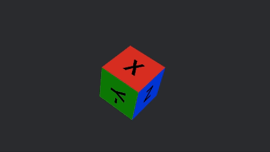

# Cube Texture Example

This project contains a demo which illustrates how to add custom text onto the different faces of a cube.

## Overview

Adding text to each face is a two-step process. First, we generate a 2D texture which will be used to cover each of 
the faces. A UV map is used to map different regions of the texture to the different cube faces.


Once face is mapped to the first 1/6th of texture, then second face to the next 1/6, etc., until all faces are covered.
In this example, the data for the faces texture is provided by the following struct and config. The mapping for this is
described using the `Mesh::ATTRIBUTE_UV_0` attribute in `cube_mesh.rs`.

```rust
pub struct CubeFace {
    text: &'static str,
    color: Color,
}

impl CubeFace {
    pub const fn new(text: &'static str, color: Color) -> Self {
        Self { text, color }
    }
}

pub const EXAMPLE_CUBE_FACES: [CubeFace; 6] = [
    CubeFace::new("X", Color::srgb(1., 0., 0.)),
    CubeFace::new("-X ", Color::srgb(0.5, 0., 0.)),
    CubeFace::new("Y", Color::srgb(0., 1., 0.)),
    CubeFace::new("-Y ", Color::srgb(0., 0.5, 0.)),
    CubeFace::new("Z", Color::srgb(0., 0., 1.)),
    CubeFace::new("-Z ", Color::srgb(0., 0., 0.5)),
];
```

# Creating the texture

An example showing the is available at [cube_face_texture.rs](examples/cube_face_texture.rs).
Run ` cargo run --example cube_face_texture`

# Wrapping the Cube.

The demo can be found in [main.rs](src/main.rs). Simply run `cargo run`. 




## Running in Web Mode

The application can be compiled to WASM so it can be viewed in a web browser via:

```cargo run --target wasm32-unknown-unknown --release```

The `--release` flag significantly increase the build time but reduces the binary size.

# Reducing the WASM binary size

Running `wasm-opt -Oz -o cube_text_example.wasm target/wasm32-unknown-unknown/release/cube_text_example.wasm` reduces 
the WASM binary size from 27MB to 16MB. Still big, but a 33% reduction is nothing to be sneezed at. 